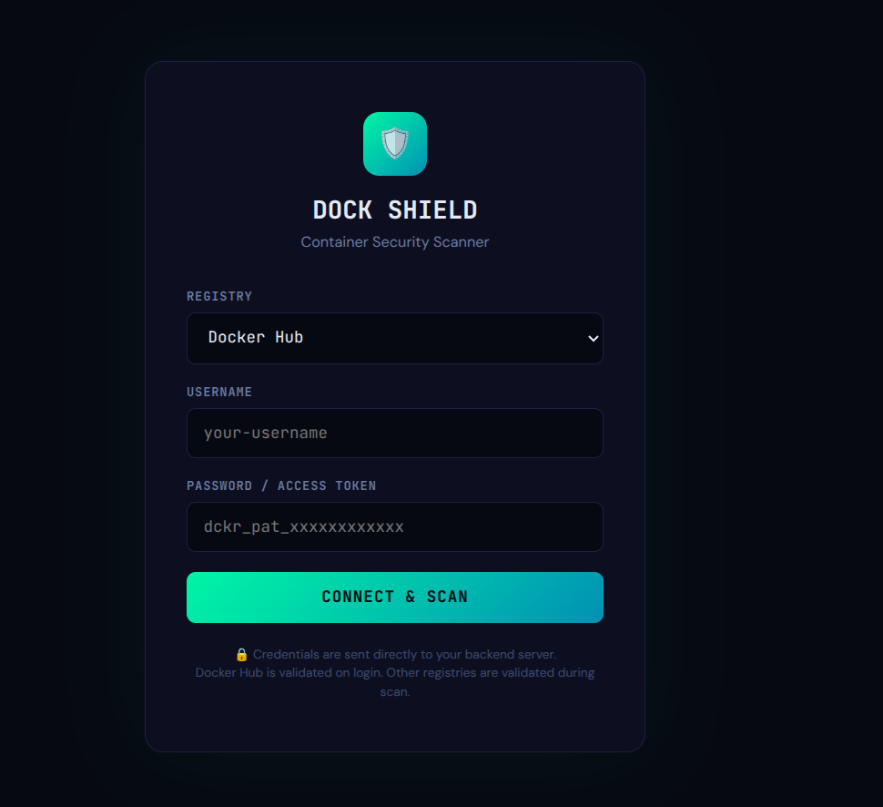
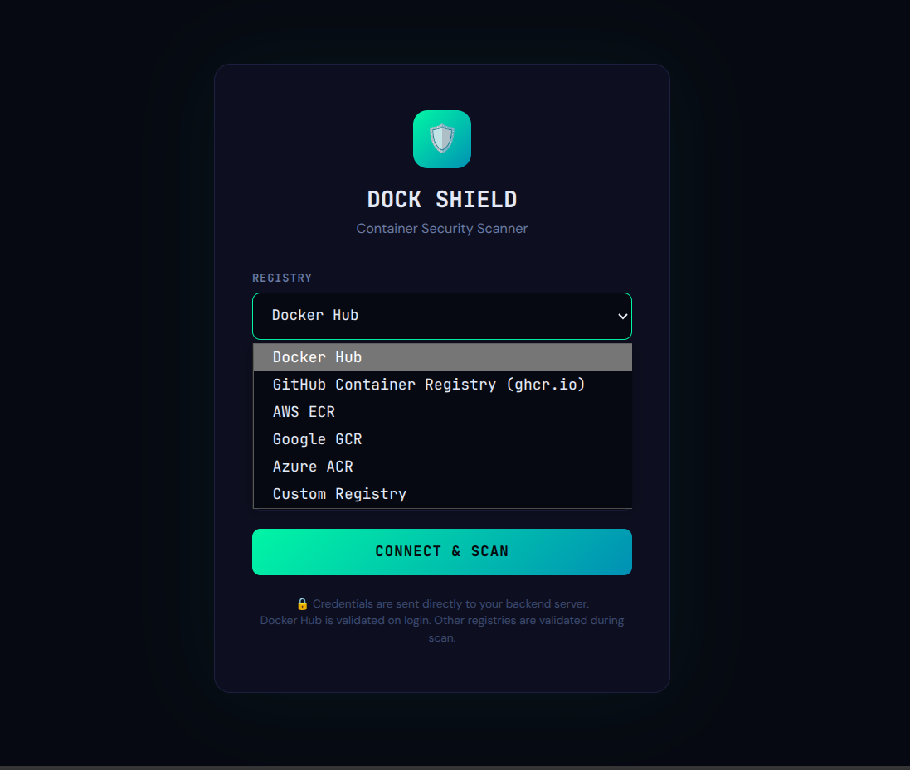
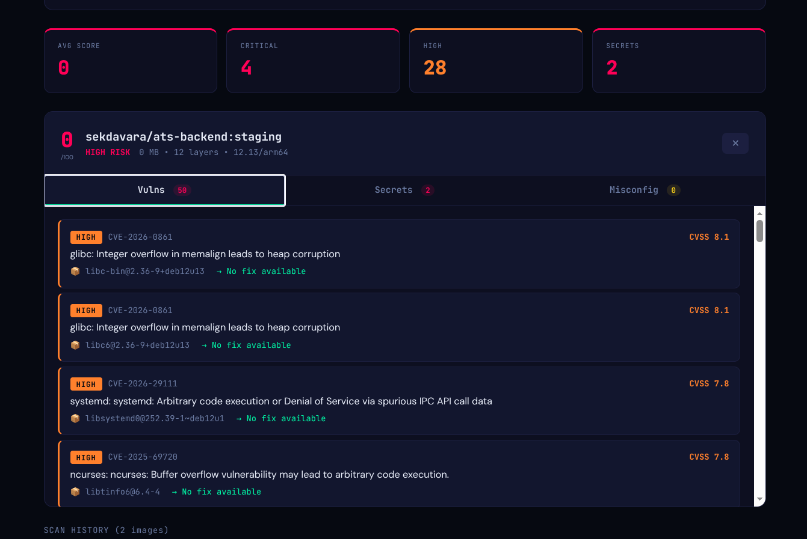

# Dock Shield

Dock Shield is a container security scanning dashboard built with:

- a Node.js backend that runs Trivy image scans
- a static Nginx frontend
- Kubernetes manifests for deployment
- Terraform for provisioning a DigitalOcean Kubernetes cluster
- GitHub Actions for CI/CD

It can scan public images directly and can scan private images by passing registry credentials to Trivy at runtime.

## What This Project Does

- scans container images for vulnerabilities
- runs Trivy secret scanning
- runs Trivy misconfiguration scanning
- shows scan results in a web UI
- deploys the app to DigitalOcean Kubernetes from GitHub Actions

## Current Architecture

This repo currently deploys:

- `dock-shield-api`: backend API, 1 replica
- `dock-shield-ui`: frontend UI, 2 replicas
- `dock-shield-api` Service: internal `ClusterIP`
- `dock-shield-ui` Service: public `LoadBalancer`
- one DigitalOcean Kubernetes cluster with one node

Traffic flow:

1. User opens the frontend `LoadBalancer` IP.
2. Nginx serves the UI.
3. Requests to `/api/*` are proxied by Nginx to the internal backend service.
4. The backend runs Trivy and returns JSON results.

## Repository Layout

```text
.
├── backend/
│   ├── Dockerfile
│   ├── package.json
│   └── server.js
├── frontend/
│   ├── Dockerfile
│   ├── index.html
│   └── nginx.conf
├── k8s/
│   └── deployment.yaml
├── terraform/
│   └── main.tf
├── .github/workflows/
│   └── ci-cd.yml
├── docker-compose.yml
└── README.md
```

## Prerequisites

For local development:

- Git
- Docker
- Docker Compose plugin or `docker-compose`

For Kubernetes access and deployment:

- DigitalOcean account
- DigitalOcean API token
- `doctl`
- `kubectl`
- Terraform

For CI/CD:

- GitHub repository
- GitHub Container Registry access
- one GitHub Actions secret:
  - `DO_TOKEN`

## Local Setup

### 1. Clone the repository

```bash
git clone <your-repo-url>
cd devsecops-pipeline
```

### 2. Start the local stack

```bash
docker compose up -d
```

If your machine uses legacy Compose:

```bash
docker-compose up -d
```

### 3. Open the app

- Frontend: `http://localhost:3000`
- Backend health check: `http://localhost:4000/health`

### 4. Stop the stack

```bash
docker compose down
```

## Local Usage

### Scan a public image

Open the UI and enter an image such as:

- `nginx:latest`
- `node:20-alpine`
- `python:3.12-slim`

### Scan a private image

Use the login form first.

Current behavior:

- Docker Hub credentials are validated on login
- other registries are stored and used during scan
- for non-Docker-Hub registries, a failed scan is where auth errors are currently surfaced

## Local API Endpoints

- `GET /health`
- `POST /api/auth/login`
- `POST /api/scan`
- `GET /api/images/local`
- `GET /api/history`

Example scan request:

```bash
curl -X POST http://localhost:4000/api/scan \
  -H "Content-Type: application/json" \
  -d '{"image":"nginx","tag":"latest"}'
```

## Deploy to DigitalOcean Manually

### 1. Export the DigitalOcean token

```bash
export TF_VAR_do_token="<your-digitalocean-token>"
```

### 2. Provision the cluster

```bash
terraform -chdir=terraform init
terraform -chdir=terraform apply
```

What Terraform creates right now:

- one DOKS cluster named `dock-shield-cluster`
- region `blr1`
- one node pool
- one node of size `s-2vcpu-2gb`

### 3. Install and configure `doctl`

Authenticate:

```bash
doctl auth init
```

Save kubeconfig:

```bash
doctl kubernetes cluster kubeconfig save dock-shield-cluster
```

Verify access:

```bash
kubectl config current-context
kubectl get nodes
```

### 4. Build and push images manually if needed

This project is currently set up to push images to GHCR through GitHub Actions. If you want to do it manually, log in to GHCR and push both images with tags that match what you will deploy in Kubernetes.

### 5. Deploy the manifests

The manifest uses an `IMAGE_TAG` placeholder. Replace it with a real image tag first.

Example:

```bash
sed -i "s|IMAGE_TAG|latest|g" k8s/deployment.yaml
kubectl apply -f k8s/
```

### 6. Get the public IP

```bash
kubectl get svc dock-shield-ui
```

Open the `EXTERNAL-IP` in your browser.

## GitHub Actions Deployment Flow

The workflow in `.github/workflows/ci-cd.yml` does the following on pushes to `main`:

1. runs Gitleaks
2. runs Semgrep
3. builds backend image
4. scans backend image with Trivy
5. pushes backend image to GHCR
6. builds frontend image
7. pushes frontend image to GHCR
8. checks whether the DOKS cluster already exists
9. creates the cluster only if it does not already exist
10. exports kubeconfig from DigitalOcean
11. replaces `IMAGE_TAG` in the Kubernetes manifest with the current commit SHA
12. deploys the manifests with `kubectl apply -f k8s/`

## GitHub Secrets

Create this repository secret:

- `DO_TOKEN`: your DigitalOcean API token

Notes:

- GHCR push uses `GITHUB_TOKEN`, which GitHub Actions provides automatically
- no extra GHCR secret is required in the current workflow

## Step-by-Step: Set Up Another Developer From Scratch

### Option A: Local only

Use this if the developer just wants to run and test the project locally.

1. Install Docker and Git.
2. Clone the repo.
3. Run `docker compose up -d`.
4. Open `http://localhost:3000`.
5. Test a scan with `nginx:latest`.

### Option B: Full cloud setup

Use this if the developer needs the same DigitalOcean + GitHub Actions deployment flow.

1. Install Git, Docker, Terraform, `doctl`, and `kubectl`.
2. Clone the repo.
3. Create a DigitalOcean API token.
4. In GitHub, add repository secret `DO_TOKEN`.
5. Push the repo to GitHub.
6. Either:
   - let GitHub Actions create the cluster on first push to `main`, or
   - run Terraform manually first
7. Run:

```bash
doctl auth init
doctl kubernetes cluster kubeconfig save dock-shield-cluster
kubectl get nodes
kubectl get svc -A
```

8. Open the `dock-shield-ui` external IP.

## Kubernetes Resources in This Repo

From `k8s/deployment.yaml`:

- Backend Deployment
  - image: `ghcr.io/kirtan-lokadiya/dock-shield-devsecops/dock-shield-api:<tag>`
  - 1 replica
  - port `4000`
  - readiness and liveness probes on `/health`
  - `emptyDir` cache for Trivy

- Frontend Deployment
  - image: `ghcr.io/kirtan-lokadiya/dock-shield-devsecops/dock-shield-ui:<tag>`
  - 2 replicas
  - port `80`

- Backend Service
  - `ClusterIP`
  - internal only

- Frontend Service
  - `LoadBalancer`
  - public entrypoint

## Security Scanning Behavior

The backend runs real Trivy scans:

- vulnerability scan
- secret scan
- misconfiguration scan

Additional behavior:

- Docker Hub credentials are validated on login
- Debian-based vulnerability results are enriched with official Debian tracker guidance when available
- scan history is in memory only
- Trivy cache in Kubernetes is not persistent across pod recreation

## Common Commands

### Docker

```bash
docker compose up -d
docker compose down
docker compose logs -f
```

### Terraform

```bash
terraform -chdir=terraform init
terraform -chdir=terraform plan
terraform -chdir=terraform apply
terraform -chdir=terraform destroy
```

### Kubernetes

```bash
kubectl get nodes
kubectl get pods -A
kubectl get svc -A
kubectl logs deploy/dock-shield-api
kubectl rollout status deploy/dock-shield-api
kubectl rollout status deploy/dock-shield-ui
```

### DigitalOcean CLI

```bash
doctl auth init
doctl kubernetes cluster list
doctl kubernetes cluster kubeconfig save dock-shield-cluster
```

## Troubleshooting

### `kubectl` connects to `localhost:8080`

Your kubeconfig is not set.

Fix:

```bash
doctl kubernetes cluster kubeconfig save dock-shield-cluster
kubectl config current-context
```

### GitHub Actions fails because Kubernetes version is invalid

The Terraform code already uses the latest supported DOKS version dynamically. If you changed that logic, revert to the data source based version selection.

### GitHub Actions tries to recreate the cluster

The workflow checks for the cluster by name before running Terraform. It should not recreate the cluster unless:

- the cluster was deleted
- the cluster name changed
- the existence check failed

### UI shows `504 Gateway Time-out`

That usually means Nginx timed out waiting for the backend scan. The repo already includes increased proxy timeouts in `frontend/nginx.conf`, but large first-time scans can still be slow.

### A scan says `No fix available`

For Debian-based images, the backend now tries to replace that with vendor guidance from the Debian Security Tracker. For non-Debian images, Trivy advisory data is still the fallback.

### Docker Hub login accepts bad credentials

That should no longer happen for Docker Hub. If it does, ensure you deployed the latest backend image.








